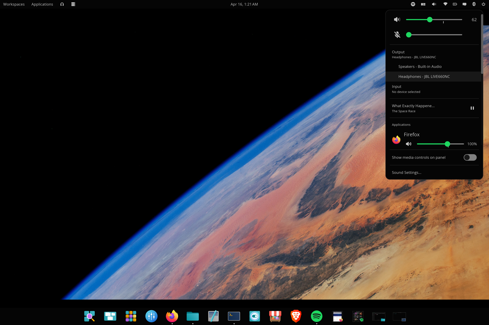

# cosmic-app-volume

A COSMIC desktop panel applet for per-application volume control and audio routing — replaces the default sound applet with a full mixer.



## What it does

This is a fork of the upstream `cosmic-applet-audio` from System76, extended with per-application controls. You get everything the default sound applet does, plus:

**Per-application volume sliders** — Independent volume for every app currently producing audio (Firefox, Spotify, Discord, games, etc.) with mute toggle.

**Per-application output routing** — Click the "Output" row beneath any app to expand a list of all available output devices, then click one to move that app's audio there. Same flow as the master Output picker.

**Per-application input routing** — Apps capturing microphone audio (Discord calls, OBS, browser meetings, recording software) get their own section with the same volume + routing controls. Pick which input device each app records from.

**Application icons and large names** — Each app row shows the application's own icon (Firefox, Spotify, Brave, etc.) at 32px with the app name at 18px so you can scan the list at a glance.

**Scrollable popup** — When many apps are playing, the per-app section scrolls. The "Sound Settings" link and media controls toggle stay pinned at the bottom.

**Everything from the upstream applet** — Smooth master output and input volume sliders with scroll-wheel control on the panel icon, output and input device pickers, MPRIS now-playing with transport controls, "Show media controls on panel" toggle, "Sound Settings…" link.

## Screenshots

| Master controls + per-app | Output picker (master) | Input picker (master) | Per-app output picker | Per-app routing + recording |
|---|---|---|---|---|
|  |  |  |  |  |

## Why this exists

System76 deferred per-application volume control to a future COSMIC release ([cosmic-settings#6](https://github.com/pop-os/cosmic-settings/issues/6) — "These can arrive in COSMIC V2"). With the Epoch 2 / Epoch 3 timeline that's likely late 2026 or 2027. Until then, the only way to control per-app volume on COSMIC is to open `pavucontrol` every time. This applet fills that gap.

## Dependencies

- [COSMIC desktop](https://github.com/pop-os/cosmic-epoch) with panel
- [PipeWire](https://pipewire.org/) with the PulseAudio compatibility layer (default on most distros)
- `libpulse` — PulseAudio client library (for the PipeWire compat API)
- Rust + Cargo (for building)
- `just` (build command runner)

The applet talks to PipeWire through `libpulse`'s sink-input / source-output API. PipeWire ships a PulseAudio compatibility layer by default, so this works on any modern PipeWire-based distro.

### Install dependencies

If you're already running COSMIC on a current distro, PipeWire is there. You mainly need the PulseAudio dev headers, Rust, and `just`.

**Arch / CachyOS:**

```sh
sudo pacman -S libpulse rust just pkgconf
```

**Fedora:**

```sh
sudo dnf install pulseaudio-libs-devel rust cargo just pkgconf-pkg-config wayland-devel libxkbcommon-devel
```

**Ubuntu / Pop!_OS:**

```sh
sudo apt install libpulse-dev build-essential pkg-config libwayland-dev libxkbcommon-dev
curl --proto '=https' --tlsv1.2 -sSf https://sh.rustup.rs | sh
cargo install just
```

> **Note:** If the build fails with a missing header error, install the corresponding `-dev` (Ubuntu) or `-devel` (Fedora) package. See the [cosmic-epoch README](https://github.com/pop-os/cosmic-epoch) for the full COSMIC build dependency list.

## Install

```sh
git clone https://github.com/ctsdownloads/cosmic-app-volume.git
cd cosmic-app-volume
just install
```

The first build takes a while (3-5 minutes) because it pulls and compiles libcosmic from git. Subsequent builds are fast.

After install, restart `cosmic-panel` so it picks up the new applet:

```sh
killall cosmic-panel
```

It auto-respawns immediately.

### Add the applet

Open **Settings → Desktop → Panel → Configure Panel Applets**, click **+ Add Applet**, find **App Volume**, drag it to the right section of your panel.

You'll probably want to remove the default "Sound" applet from the panel since this one replaces it.

## Usage

**Click the speaker icon** in your panel to open the popup.

**Master controls** — Output volume slider with mute (scroll wheel works on the panel icon), input/microphone volume slider with mute, expandable Output and Input device pickers (same as the upstream applet).

**Now playing** — If an MPRIS-compatible app is playing media, you'll see track info with skip-back / play-pause / skip-forward buttons.

**Applications section** — Each app currently playing audio gets its own row:

- Application icon and name at the top
- Volume slider 0–150% with mute toggle on the left
- Current output device shown beneath; click it to expand a picker and move that app to a different output

**Recording section** — Apps capturing microphone audio get the same treatment:

- Application icon and name
- Volume slider with mic-style mute toggle
- Current input device shown beneath; click it to expand a picker and route that app to a different microphone

**Sound Settings** — Opens the COSMIC Settings sound page for advanced configuration.

## How it works

The applet runs entirely within the COSMIC panel process. There is no background daemon.

- **Master volume controls** use System76's `cosmic-settings-sound-subscription`, the same reactive PipeWire model the upstream `cosmic-applet-audio` uses. This is what gives the master slider its smoothness.
- **Per-app controls** use a dedicated thread running the PulseAudio mainloop, talking to PipeWire through the PulseAudio compatibility layer. The thread subscribes to sink-input and source-output events, sends snapshots to the UI through a channel, and receives volume / mute / route commands back.
- **Filtering** removes system event sounds (volume change beeps, notification chimes), short-lived audio feedback streams, and noise generators like `pw-play`, `pavucontrol`, and `pw-record` so only real applications appear.

### Detection methods

| Stream type | Source | Volume / mute | Routing |
|---|---|---|---|
| Application playback | PulseAudio sink-input list | `set_sink_input_volume` / `set_sink_input_mute` | `move_sink_input_by_index` |
| Application recording | PulseAudio source-output list | `set_source_output_volume` / `set_source_output_mute` | `move_source_output_by_index` |
| Master output / input | `cosmic-settings-sound-subscription` | (handled by upstream model) | (handled by upstream model) |

## Customizing the popup height

The scrollable per-app section is capped at 500px. If that feels off on your screen, change one line in `src/lib.rs`:

```rust
container(scrollable(audio_content)).max_height(500),
```

Bigger number = more apps visible before scrolling kicks in.

## Uninstall

```sh
just uninstall
killall cosmic-panel
```

Then remove the applet from the panel in Settings → Desktop → Panel.

## Credits

This is a fork of [`cosmic-applet-audio`](https://github.com/pop-os/cosmic-applets/tree/master/cosmic-applet-audio) by System76. All the polish in the master volume controls, output/input device pickers, MPRIS integration, and panel icon behavior comes from their work. The per-application section is the addition.

## License

GPL-3.0-only (matching the upstream applet).
