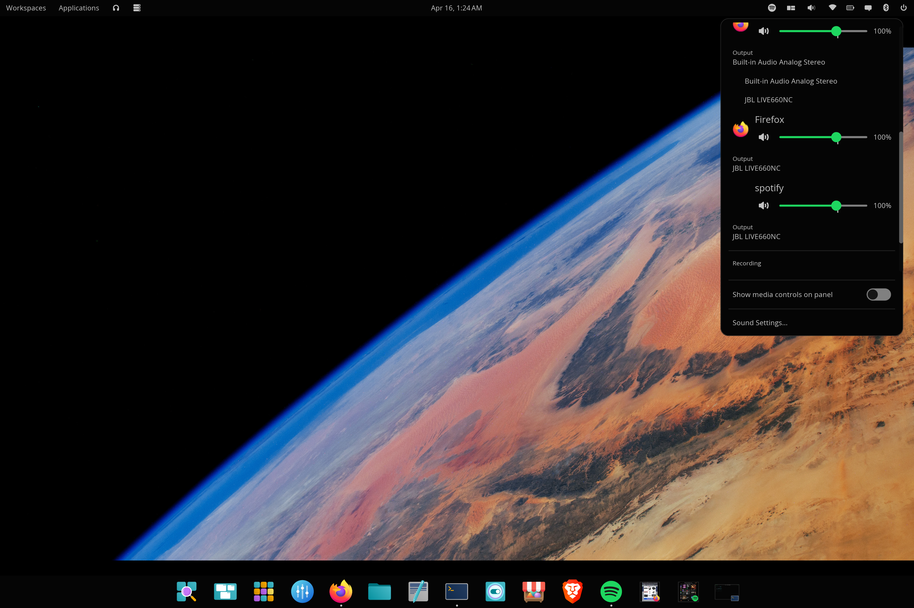

# cosmic-app-volume

A COSMIC desktop panel applet that adds **per-application volume control and per-application audio routing** — the missing piece in COSMIC's audio stack today.



## How this differs from COSMIC's built-in sound applet

COSMIC ships with a sound applet (`cosmic-applet-audio`) that gives you master output volume, master input volume, and a picker for which output / input device the system uses. **What it does not give you is per-application control.** If Spotify is too loud while you're on a Discord call, your only option today is to open `pavucontrol` and use it as a separate app.

System76 has acknowledged this gap and explicitly deferred it: see [pop-os/cosmic-settings #6](https://github.com/pop-os/cosmic-settings/issues/6) — *"Do not include per-application volume levels. These can arrive in COSMIC V2."* With COSMIC currently in Epoch 1 and Epoch 2 / Epoch 3 still on the roadmap, that's likely a 2026 / 2027 timeline. This applet fills the gap **now**.

This applet is a fork of `cosmic-applet-audio` — it keeps everything System76 built (so you don't lose anything by switching to it) and adds the per-app section underneath. Specifically, this applet does **everything the stock applet does**, plus:

| Feature | Stock `cosmic-applet-audio` | `cosmic-app-volume` (this) |
| --- | --- | --- |
| Master output volume + mute | ✅ | ✅ |
| Master input volume + mute | ✅ | ✅ |
| Output device picker | ✅ | ✅ |
| Input device picker | ✅ | ✅ |
| Scroll-wheel volume on icon | ✅ | ✅ |
| MPRIS now-playing + transport | ✅ | ✅ |
| **Per-app volume sliders** | ❌ | ✅ |
| **Per-app mute toggles** | ❌ | ✅ |
| **Per-app output routing** (move app's audio to a different device) | ❌ | ✅ |
| **Per-app input routing** (move app's mic source to a different device) | ❌ | ✅ |
| **Per-app recording control** (mic-using apps shown separately) | ❌ | ✅ |
| **App icons + large names** in the mixer | ❌ | ✅ |
| **Scrollable popup** when many apps are playing | ❌ | ✅ |

You can run this **alongside** the stock applet, but most people will want to remove the stock applet from their panel after installing this one — they look almost identical at the top, and having both is redundant.

## Screenshots

The popup expands the master volume controls at the top, then any active media player, then a per-application section, then a recording section if any app is using a microphone. Output and input device pickers are click-to-expand revealers — same for the per-app routing pickers.

**Master output device picker expanded** — click the "Output" row beneath the master volume slider to choose between available output devices. Now-playing track and per-app Firefox row visible below.


**Master input device picker expanded** — same revealer pattern for switching between available microphones (here showing the laptop's built-in mic and the JBL headphones in handsfree mode).


**Per-app output routing** — each app in the Applications section gets its own Output picker beneath. Click it to move that app's audio to a different device independent of the system default. Here Firefox's picker is expanded showing both available outputs.


**Multiple apps playing simultaneously** — two Firefox streams and a Spotify stream all listed independently with their own volume sliders, mute toggles, and current output device shown beneath each.


**Recording section** — apps capturing microphone audio appear in a separate section below playback apps. Same controls — volume slider, mute toggle, input device picker. Firefox is shown here recording at 55% with the mic-style icon.


## Dependencies

- [COSMIC desktop](https://github.com/pop-os/cosmic-epoch) (Epoch 1 / 1.0.x or later)
- [PipeWire](https://pipewire.org/) with the PulseAudio compatibility layer (default on every modern distro that ships PipeWire)
- PulseAudio client library development headers (this is a **build-time** dependency)
- Rust toolchain (`rustc` + `cargo`)
- [`just`](https://github.com/casey/just) command runner

This applet talks to PipeWire through `libpulse`'s sink-input / source-output API. PipeWire ships a PulseAudio compatibility layer by default, so this works on any PipeWire-based distro without extra configuration. It does **not** require running PulseAudio itself.

You'll also need the standard COSMIC build dependencies (Wayland headers, xkbcommon headers, etc.). The package commands below cover those too.

### Verified package names per distro

> **Important:** the package containing the libpulse C headers has a different name on every distro. The runtime library is almost always already installed; what you need to add is the `-dev` / `-devel` package.

#### Arch / CachyOS / Manjaro

```sh
sudo pacman -S libpulse rust just pkgconf base-devel wayland libxkbcommon
```

The Arch [`libpulse`](https://archlinux.org/packages/extra/x86_64/libpulse/) package includes both the runtime library and the headers — there is no separate `-dev` package on Arch.

#### Fedora / Nobara / Bazzite

```sh
sudo dnf install pulseaudio-libs-devel rust cargo just pkgconf-pkg-config wayland-devel libxkbcommon-devel
```

The package is [`pulseaudio-libs-devel`](https://packages.fedoraproject.org/pkgs/pulseaudio/pulseaudio-libs-devel/) even on PipeWire-based Fedora — the package provides the libpulse headers, not the PulseAudio daemon.

#### Bluefin / Aurora / other rpm-ostree systems

```sh
rpm-ostree install pulseaudio-libs-devel
```

Then reboot, then install Rust and `just` via your normal user-space tooling (e.g. `brew install rust just` or `cargo install just` after installing rustup).

#### Ubuntu / Pop!_OS / Debian / Linux Mint

```sh
sudo apt install libpulse-dev build-essential pkg-config libwayland-dev libxkbcommon-dev
curl --proto '=https' --tlsv1.2 -sSf https://sh.rustup.rs | sh
cargo install just
```

The package is [`libpulse-dev`](https://packages.ubuntu.com/libpulse-dev) on Ubuntu/Debian. It pulls in `libpulse0` (the runtime) automatically. On Ubuntu 24.04 LTS it lives in `universe`, which is enabled by default.

#### openSUSE Tumbleweed / Leap

```sh
sudo zypper install libpulse-devel rust cargo just pkgconf-pkg-config wayland-devel libxkbcommon-devel
```

> **If the build fails with a missing header error,** install the corresponding `-dev` (Debian-family) or `-devel` (RPM-family) package for whatever it can't find. See the [cosmic-epoch README](https://github.com/pop-os/cosmic-epoch) for the full list of build dependencies COSMIC itself needs.

### Verifying you have what you need before building

Run these three checks first — they take 5 seconds and save you from a half-hour failed compile:

```sh
# 1. PipeWire's PulseAudio compat is running (you should see a number, not an error)
pactl info | grep "Server Name"

# 2. libpulse headers are installed (should print a path, not "not found")
pkg-config --cflags libpulse

# 3. Rust + just are installed
rustc --version && just --version
```

If all three return real output, you're ready to build.

## Install

```sh
git clone https://github.com/ctsdownloads/cosmic-app-volume.git
cd cosmic-app-volume
just install
```

The first build takes 3–5 minutes because it pulls and compiles `libcosmic` from git. Subsequent rebuilds are fast.

After install, restart `cosmic-panel` so it discovers the new applet:

```sh
killall cosmic-panel
```

It auto-respawns within a second — no log-out required.

### Add the applet to your panel

Open **Settings → Desktop → Panel → Configure Panel Applets**, click **+ Add Applet**, find **App Volume**, drag it into the right section of your panel.

Once it's in place and you've confirmed it works, you'll probably want to **remove the stock Sound applet** from the panel — they're nearly identical at the top, so keeping both is just visual noise.

## Usage

**Click the speaker icon** in the panel to open the popup.

**Master controls** at the top: output volume slider with mute, input/microphone volume slider with mute, expandable Output and Input device pickers. Scroll-wheel on the panel icon adjusts master volume in 5% steps.

**Now playing** appears beneath when an MPRIS-compatible player is active (Spotify, Firefox media, mpv, etc.) with track info and skip-back / play-pause / skip-forward buttons.

**Applications section** shows every app currently producing audio, each as its own row:

- App icon (32px) and app name (18px) at the top
- Volume slider 0–150% with mute toggle on the left
- Current output device shown beneath; click the row to expand a picker and move that app's audio to any other available output

**Recording section** shows every app currently capturing audio (Discord during a call, OBS recording, browser meetings, etc.):

- Same large name and icon
- Volume slider with mic-style mute toggle
- Current input device shown beneath; click to expand and route that app to a different microphone

**Sound Settings…** at the bottom opens the COSMIC Settings sound page for advanced configuration (sample rates, profiles, etc.).

## How it works

The applet runs entirely within the COSMIC panel process — there is no background daemon, no system service, nothing to enable.

- **Master controls** use System76's reactive `cosmic-settings-sound-subscription`, the same model the stock applet uses. This is what gives the master sliders their smoothness.
- **Per-app controls** use a dedicated thread running the libpulse mainloop, talking to PipeWire through its PulseAudio compat layer. The thread subscribes to `sink-input` and `source-output` events, sends snapshots to the UI through a channel, and receives volume / mute / route commands back.
- **Filtering** removes system event sounds (volume change beeps, notification chimes), short-lived audio feedback streams from `pw-play` / `pavucontrol` / `pw-record`, and anything tagged with `media.role=event`. Only real applications appear in the mixer.

### What's actually happening underneath

| Stream type | Discovered via | Volume / mute | Routing to a different device |
| --- | --- | --- | --- |
| App playback | libpulse `get_sink_input_info_list` | `set_sink_input_volume` / `set_sink_input_mute` | `move_sink_input_by_index` |
| App recording | libpulse `get_source_output_info_list` | `set_source_output_volume` / `set_source_output_mute` | `move_source_output_by_index` |
| Master output / input | `cosmic-settings-sound-subscription` | (handled by System76's reactive model) | (handled by System76's reactive model) |

These are exactly the same APIs `pavucontrol` uses — this applet is essentially `pavucontrol`'s mixer compressed into a panel popup with COSMIC styling.

## Customizing the popup height

The scrollable per-app section is capped at 500px so the popup doesn't grow taller than your screen. If that feels off, change one line in `src/lib.rs`:

```rust
container(scrollable(audio_content)).max_height(500),
```

Bigger number = more apps visible before scrolling kicks in.

## Uninstall

```sh
just uninstall
killall cosmic-panel
```

Then remove the applet from the panel in **Settings → Desktop → Panel → Configure Panel Applets**.

## Credits

This is a fork of [`cosmic-applet-audio`](https://github.com/pop-os/cosmic-applets/tree/master/cosmic-applet-audio) by System76. All the polish in the master volume controls, output/input device pickers, MPRIS integration, and panel-icon scroll behavior comes directly from their work — the per-application section is the addition.

## License

GPL-3.0-only (matching the upstream applet).
